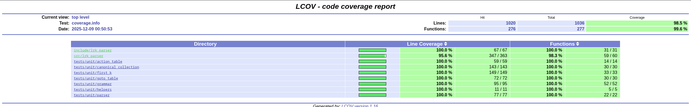

## LR(k) Parser Implementation

Этот проект представляет собой реализацию LR(k) синтаксического анализатора (парсера) на C++.

## Обзор Возможностей
  * **LR(k) Анализатор:** Ядро проекта — это реализация LR(k) парсера, способного анализировать входные строки, используя заданную грамматику и $\text{k}$-просмотр (lookahead).
  * **Качество Кода:** Используется строгий контроль качества с помощью инструментов статического анализа и форматирования.
  * **Система Сборки CMake:** Использование `CMakePresets.json` для удобной настройки различных конфигураций сборки (Development, CI, Sanitizers, Coverage).

-----

## Сборка и Запуск

### Требования

Для сборки и обеспечения качества кода требуются следующие инструменты:

| Инструмент | Минимальная Версия | Назначение |
| :--- | :--- | :--- |
| **`CMake`** | 3.25 | Система сборки |
| **`C++`** | C++23 (GCC/Clang) | |
| **`Ninja`** | | Генератор сборки |
| **`Google Test`** | (Включен в проект) | Модульное тестирование |
| **`clang-format`** | 19 | Автоматическое форматирование кода |
| **`clang-tidy`** | 19 | Статический анализ кода |
| **`lcov` / `gcov`** | | Инструменты для анализа покрытия кода |

### Шаги Сборки

1.**Конфигурирование (Например, отладочная сборка с Address Sanitizer):**

```bash
cmake --preset dev-debug-asan
```

2.**Сборка:**

```bash
cmake --build --preset dev-debug-asan
```

[*(подробнее про возможности сбоки)*](https://github.com/kxigor/cpp-project-template)

### Тестирование и Покрытие Кода

Все модульные тесты запускаются с помощью `ctest`.

#### Запуск Тестов

```bash
# Запуск тестов для выбранного пресета (например, dev-debug-asan)
ctest --preset dev-debug-asan
```

#### Покрытие Кода (Coverage)

Проект настроен так, чтобы **покрытие кода (Code Coverage)** не опускалось **ниже 95%**.

Для генерации отчета о покрытии:

1.**Сконфигурируйте и соберите проект, используя пресет `dev-debug-coverage`:**

```bash
cmake --preset dev-debug-coverage
cmake --build --preset dev-debug-coverage
```

2.**Соберите целевой объект `coverage` (это запустит тесты, соберет данные `gcov`/`lcov` и сгенерирует отчет):**

```bash
cmake --build --preset dev-debug-coverage --target coverage
```

3.**Откройте отчет:**

HTML-отчет будет сохранен в папке сборки.
```bash
build/dev-debug-coverage/coverage_report/index.html
```

-----

## Покрытие 98.5 %



## Использование Библиотеки

Основной класс для взаимодействия — `lrk_parser::LrkParser`, определенный в `include/lrk_parser/parser.hpp`.

### Основной Интерфейс

```cpp
void fit(const Grammar& grammar, std::size_t k);
[[nodiscard]] bool predict(const StringT& word) const;
```

Значение `k` задаёт вызывающий код; при необходимости он сам организует перебор.

Грамматика создаётся через `MakeGrammar(GrammarSpec)` или текстовый адаптер `ParseGrammar`:

```cpp
#include "lrk_parser/parser.hpp"
#include "lrk_parser/text_grammar.hpp"

int main() {
  const auto grammar = lrk_parser::ParseGrammar(
      "ab", "S", {"S->aSb", "S->"}, 'S');
  if (!grammar) return 1;

  lrk_parser::LrkParser parser;
  parser.fit(*grammar, 1);
  return parser.predict("aabb") ? 0 : 1;
}
```

Структурированный вариант той же грамматики:

```cpp
auto grammar = lrk_parser::MakeGrammar({
    .terminals = "ab",
    .nonterminals = "S",
    .rules = {{'S', "aSb"}, {'S', ""}},
    .start = 'S',
});
```

Обе фабрики возвращают `std::expected`. `GrammarError` содержит причину, символ и, если ошибка относится к правилу, его индекс с нуля. У `ParseGrammar` ошибка — `std::variant<RuleSyntaxError, GrammarError>`; синтаксическая ошибка указывает индекс строки с неверной записью `S->rhs`.

`Grammar` владеет данными и предоставляет доступ только для чтения. Проверяются алфавиты, стартовый символ и правила, включая наличие продукций у используемых нетерминалов. Порядок и дубликаты правил сохраняются. Служебное стартовое правило добавляется только во внутреннее представление парсера.

Тип символа задаётся `CharT` (сейчас `char`); строки — `StringT`/`StringViewT`. Текущая реализация работает с байтами, включая `@` и `\0`; ε задаётся пустой правой частью. `MakeGrammar` сохраняет пробелы в правилах, поэтому значимые пробелы нужно объявить терминалами. `ParseGrammar` удаляет из строк правил ASCII-пробелы, табуляцию и переводы строк (` \t\n\r\f\v`).
